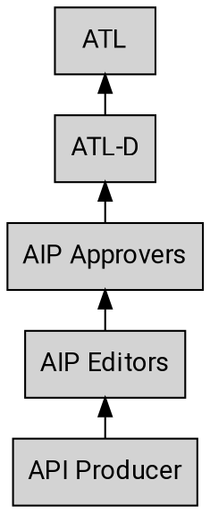
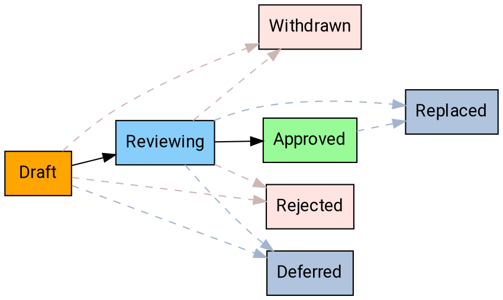

---
aip:
  id: 1
  state: approved
  created: 2018-08-20
  updated: 2019-05-04
  type: process
js:
  - /assets/js/graphviz/viz.js
  - /assets/js/graphviz/lite.render.js
  - /assets/js/aip/aip-graphviz.js
redirect_from:
  - /1
  - /01
  - /001
  - /0001
---

# AIP Purpose and Guidelines

As the corpus of Google APIs has grown and the API Governance team has grown to
meet the demand of supporting them, it is increasingly necessary to have a
corpus of documentation for API producers, reviewers, and other interested
parties to reference. The API style guide and introductory One Platform
documentation are intentionally terse and high-level. The AIP collection
provides a way to provide consistent documentation for API design guidance.

## What is an AIP?

AIP stands for **API Improvement Proposal**, which is a design document
providing high-level, concise documentation for API development. They are to
serve as the source of truth for API-related documentation at Google and the
means by which API teams discuss and come to consensus on API guidance. AIPs
are maintained as Markdown files in the [AIP GitHub repository][].

## Types of AIPs

There are several different types of AIPs, described below. The list of AIP
types may evolve over time as necessary.

### Guidance

These AIPs describe guidance on API design. These are provided as instruction
for API producers to help write simple, intuitive, and consistent APIs, and are
used by API reviewers as a basis for review comments.

### Process

These AIPs describe a process surrounding API design. They often affect the AIP
process itself and are used to enhance the way in which AIPs are handled.

## Stakeholders

As with any process there are many different stakeholders when it comes to
reviewing and working with AIPs. Below is a summary of the escalation path
starting with the API producer.

### ATL and ATL-Ds

The current ATL (area technical lead) for APIs at Google is Eric Brewer; he has
delegated ATL responsibilities ("ATL-D") for API Infrastructure to Hong Zhang
(@wora) and API Design to JJ Geewax (@jgeewax). This document uses ATL and
ATL-D consistently to refer to this role.

As noted in the diagram above, the ATL is the final decision-maker on the AIP
process and the point of escalation if necessary.

### Approvers

The approvers are the set of people who make decisions on AIPs. The general
goal is that the AIP process is collaborative and that we largely work on the
basis of consensus. However, a limited number of designated approvers is
necessary, and these Googlers will be approvers for each AIP.

The list of AIP approvers is currently:

- Hong Zhang (@wora)
- JJ Geewax (@jgeewax)
- Jon Skeet (@jskeet)

AIP approvership is by invitation of the current approvers.

### Editors

The editors are those responsible for the administrative and editorial aspects
of shepherding AIPs and managing the AIP pipeline and workflow. They approve
PRs to AIPs, assign proposal numbers, manage the agenda, set AIP states, and so
forth. They also ensure that AIPs are readable (proper spelling, grammar,
sentence structure, markup, etc.).

AIP approvers are all considered to be editors. The list of additional AIP
editors is currently:

- Luke Sneeringer (@lukesneeringer)

AIP editorship is by invitation of the current approvers.

## Domain-specific AIPs

Some AIPs may be specific to a particular domain (for example, only to APIs
within a certain PA, or even a certain team). In this situation, the group will
be given a particular block of AIPs to use in accordance with [AIP-2][], and
the applicable AIPs will clearly indicate their scope.

## States

At any given time, AIPs may exist in a variety of states as they work their way
through the process. The following is a summary of each state.

### Draft

The initial state for an AIP is the "Draft" state. This means that the AIP is
being discussed and iterated upon, primarily by the original authors. While the
editors and approvers _may_ get involved at this stage, it is not necessary.

**Note:** If significant, high-level iteration is required, it is recommended
to draft AIPs in a Google doc instead of a PR. AIPs that are migrated into the
AIP system from Google Docs **may** skip the draft state and go directly to
reviewing.

### Reviewing

Once discussion on an AIP has generally concluded, but before it is formally
accepted it moves to the "Reviewing" state. This means that the authors have
reached a general consensus on the proposal and the approvers are now involved.
At this stage the approvers may request changes or suggest alternatives to the
proposal before moving forward.

### Approved

Once an approved AIP has been implemented (which often means writing code to
support the proposal), it enters "approved" state and is considered "best
current practice".

### Withdrawn

If an AIP is withdrawn by the author or champion, it enters "withdrawn" state.
AIPs that are withdrawn may be taken up by another champion.

### Rejected

If an AIP is rejected by the AIP approvers, it enters "rejected" state. AIPs
that are rejected remain, and provide documentation and reference to inform
future discussions.

### Deferred

If an AIP has not been acted upon for a significant period of time, the editors
may mark it as "deferred".

### Replaced

If an AIP has been replaced by another AIP, it enters "replaced" state. AIP
editors are responsible to provide a notice explaining the replacement and
rationale (the replacement AIP should also clearly explain the rationale).

In general, API producers should rely primarily on AIPs in the "approved"
state.

## Workflow

The following workflow describes the process for proposing an AIP, and moving
an AIP from proposal to implementation to final acceptance.

### Overview

### Proposing an AIP

In order to propose an AIP, first circulate the fundamental idea for the AIP on
api-design@google.com for initial feedback. It should generally be possible to
describe the idea in a couple of pages. In most cases, it is best to circulate
a traditional design doc to get initial comments.

Once ready, create a PR with a new file in the AIP directory using a file
titled `new.md`. Assign @googleapis/aip-editors as the PR reviewer, and ensure
that the PR is editable by maintainers.

In most circumstances, the editors will assign the proposal an AIP number and
submit the PR with the AIP in the "Draft" state. The editors may reject an AIP
outright if they have an obvious reason to do so (e.g. the proposal was already
discussed and rejected in another AIP or is fundamentally unsound), in which
case the PR is not merged.

### Discussing an AIP

Once the PR is submitted, the AIP author is responsible for championing the AIP
on the api-design@google.com list. This means that the author is responsible
for pushing towards consensus around the proposal. This may involve mailing
list discussions as well as discussions at the regularly scheduled meetings for
the API Governance team.

The AIP author may modify the AIP over the course of discussion by submitting
follow-up PRs to the AIP.

### Accepting an AIP

The approvers and editors will work together to ensure that qualified proposals
do not linger in review. Once an AIP is ready and there is a general consensus
between stakeholders, the approvers will vote to approve the AIP. If the AIP is
approved by unanimous consent, the editors will update the state of the AIP to
reflect this.

### Withdrawing or Rejecting an AIP

The author of an AIP may decide, after further consideration, that an AIP
should not advance. If so, the author may withdraw the AIP by sending a PR
adding a notice of withdrawal with an explanation of the rationale.
Additionally, the author may be unable to get consensus among the group and the
AIP approvers may elect to reject the AIP. In this situation, the AIP approvers
or editors shall send a PR adding a notice of rejection with an explanation of
the rationale. In both cases, the AIP editors shall update the state
accordingly.

### Replacing an AIP

In rare cases, it may be necessary to replace an AIP with another one. This is
not general practice: minor edits to approved AIPs are acceptable, and will be
the common way to tweak guidance. However, if new guidance fundamentally alters
the old guidance in some way, then the AIP editors shall create a new AIP that,
once approved, will replace the old one. The old one then enters "Replaced"
state, and will link to the new, current AIP.

## Changelog

- **2019-05-04**: Updated the AIP to refer to GitHub processes, rather than
  internal processes.

[aip-2]: ./0002.md
[aip github repository]: https://github.com/googleapis/aip
