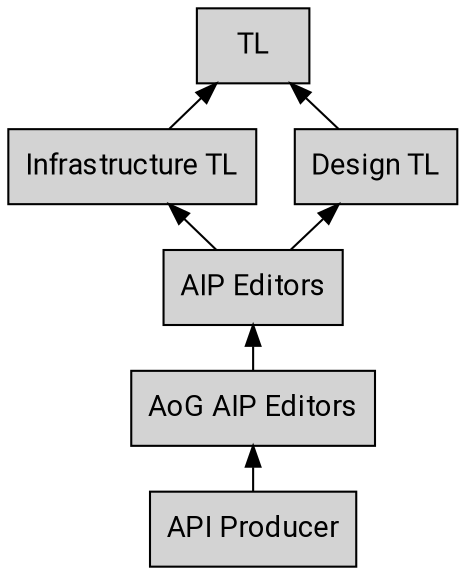
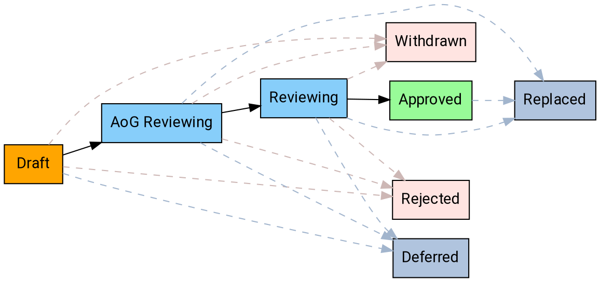

---
aip:
  id: 3001
  state: draft
  created: 2019-10-03
  updated: 2019-10-03
  type: process
  scope: aog
js:
  - /assets/js/graphviz/viz.js
  - /assets/js/graphviz/lite.render.js
  - /assets/js/aip/aip-graphviz.js
permalink: /3001
---

# Actions on Google AIP Process

This AIP extends [AIP-1][] with details specific to Actions on Google AIPs
("AoG AIPs"). Any details of [AIP-1][] not modified or contradicted by this AIP
also apply to AoG AIPs.

## Stakeholders

As with any process there are many different stakeholders when it comes to
reviewing and working with AIPs. Below is a summary of the escalation path
starting with the API producer.

### Actions on Google Editors

The Actions on Google editors are the set of people who make decisions on AoG
AIPs before escalation to the general editors defined in [AIP-1][].

The list of AoG AIP editors is currently:

- Ali Ibrahim ([@ahahibrahim][])
- Richard Frankel ([@rofrankel][])
- Silvano Luciani ([@silvolu][])

The AoG editors have the same responsibilities as the general editors. They
also have the additional responsibility of establishing correctness of, and
leadership support for, the contents of AoG AIPs.

AoG AIP editorship is by invitation of the current AoG editors.

## States

AoG AIPs use the states defined in [AIP-1][], except that the "Reviewing" state
is divided into two states, "AoG Reviewing" and "Reviewing":

### AoG Reviewing

Once discussion on an AoG AIP has generally concluded, but before it is
formally accepted it moves to the “AoG Reviewing” state. This means that the
authors have reached a general consensus on the proposal and the AoG editors
are now involved. At this stage the AoG editors may request changes or suggest
alternatives to the proposal before moving forward.

**Note:** This state is effectively the same as the "Reviewing" state, except
that it involves the AoG editors rather than the general editors.

### Reviewing

This state is very similar to the "Reviewing" state in AIP 1. The only
difference is that AoG AIPs enter this state from the "AoG Reviewing" state,
not the "Draft" state.

## Workflow

The following workflow describes the process for proposing an AoG AIP, and
moving an AoG AIP from proposal to implementation to final acceptance.

### Overview

[aip-1]: ../0001.md
[@ahahibrahim]: https://github.com/ahahibrahim
[@rofrankel]: https://github.com/rofrankel
[@silvolu]: https://github.com/silvolu
