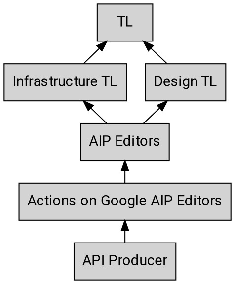

---
aip:
  id: 3001
  state: reviewing
  created: 2019-10-03
  updated: 2019-11-20
  type: process
  scope: aog
js:
  - /assets/js/graphviz/viz.js
  - /assets/js/graphviz/lite.render.js
  - /assets/js/aip/aip-graphviz.js
permalink: /aog/3001
redirect_from:
  - /3001
---

# Actions on Google AIP Process

This AIP extends [AIP-1][] with details specific to Actions on Google AIPs. Any
details of [AIP-1][] not modified or contradicted by this AIP also apply to
Actions on Google AIPs.

## Stakeholders

As with any process there are many different stakeholders when it comes to
reviewing and working with AIPs. Below is a summary of the escalation path
starting with the API producer.

### Actions on Google Editors

The Actions on Google editors are the set of people who make decisions on
Actions on Google AIPs before escalation to the general editors defined in
[AIP-1][].

The list of Actions on Google AIP editors is currently:

- Ali Ibrahim ([@ahahibrahim][])
- Richard Frankel ([@rofrankel][])
- Silvano Luciani ([@silvolu][])

The Actions on Google editors have the same responsibilities as the general
editors. They also have the additional responsibility of establishing
correctness of, and leadership support for, the contents of Actions on Google
AIPs.

Actions on Google AIP editorship is by invitation of the current Actions on
Google editors.

[aip-1]: ../0001.md
[@ahahibrahim]: https://github.com/ahahibrahim
[@rofrankel]: https://github.com/rofrankel
[@silvolu]: https://github.com/silvolu
