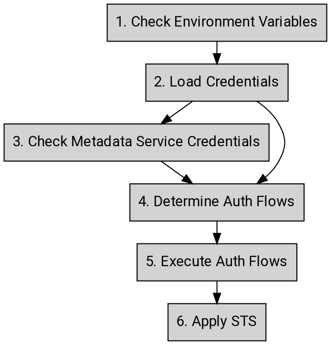

# Application Default Credentials

Google auth libraries use a strategy called _Application Default Credentials
(ADC)_ to detect and select credentials based on environment or context. With
ADC, developers should be able to run the code in different environments and
the supporting systems fetch the appropriate credentials based on each
environment in an effortless manner.

Auth libraries following the standards in these AIPs are known as _"Google
Unified Auth Clients"_, or _GUAC_ for short. The resulting libraries are
colloquially called _GUACs_.

**Note:** Because this AIP describes guidance and requirements in a
language-neutral way, it uses generic terminology which may be imprecise or
inappropriate in certain languages or environments.

## Guidance

### Credential Types

This section outlines the supported credential types of the ADC.

- **Gcloud Credential**: A credential provided by the [Gcloud tool][0] that
  identifies a human user that needs to authenticate to access Google APIs. The
  auth libraries **must** support this credential type.

- **Service Account Key**: A credential that identifies a non-human user that
  needs to authenticate to access Google APIs. The auth libraries **must**
  support this credential type.

- **OAuth Client ID**: A credential that identifies the client application
  which allows human users to sign-in through [3-legged OAuth flow][1], which
  grants the permissions to the application to access Google APIs on behalf of
  the human user. The auth libraries **may** support this credential type.

### Environment Variables

The auth libraries **must** support the following environment variables to
allow developers to provide authentication configuration for their application:

- **GOOGLE_APPLICATION_CREDENTIALS**: The specified value will be used as the
  full path for ADC to locate the credentials file. The credentials file
  **should** be one of the following types:

  - Gcloud credentials
  - Service account key

  The credentials **may** be the OAuth Client ID if it is supported by the auth
  library. Credentials file path specified at the program level (e.g. via
  client options) **must** have priority over the value of this environment
  variable.

- **GOOGLE_API_KEY**: [API keys][2] are a simple encrypted string that
  identifies an application, which are useful for accessing public data
  anonymously. The specified value of this environment variable **should** be
  used as the API key for the API requests. This value **must** be overridden
  by any user specified credentials at the programming level (e.g. through
  client options). And it **must** be ignored if GOOGLE_APPLICATION_CREDENTIALS
  is specified.

- **GOOGLE_API_USE_CLIENT_CERTIFICATE:** The specified value **must** be either
  true or false. The client certificate **must** be ignored if this variable is
  set to false. The default value is false if the value is unset.

```
GOOGLE_API_USE_CLIENT_CERTIFICATE=[true|false]
```

### Inputs & Outputs

From the input/output perspective, the inputs of _ADC_ **should** be the
credentials as well as the underlying environment such as environment variables
or metadata service that provides these credentials.

For example, the `GOOGLE_APPLICATION_CREDENTIALS` environment variable can
provide the default credential JSON as the input here, or the well-known path
that gCloud uses to store the default user credential JSON. The output is the
access token that application can use to access the Google APIs. This access
token **may** be a bearer token, a certificate bound token or STS depending on
the chosen authentication flow.

## Expected Behavior

This section outlines the expected behavior of the ADC. Auth libraries **must**
implement these concepts in order to be considered complete.



1. **Check environment variables**
   1. Check GOOGLE_APPLICATION_CREDENTIALS
      1. If set, go to step (2.2)
   2. Check GOOGLE_API_KEY
      1. If set, use the provided API key _[END]_
   3. If neither of above is set, go to step (2)
2. **Load credentials**
3. Check gcloud default credentials through its default path
   1. If found go to step (2.2)
   2. Otherwise go to step (3)
4. Check the provided credential type
   1. If the credential is gcloud credentials, go to step (4)
   2. If the credential is a service account key JSON, go to step (4)
   3. If the credential is unknown type, return an error saying that _[END]_
5. Credentials not found _[END]_
6. **Check Metadata Service Credentials**
7. If true, use the metadata service flow to get an access token associated
   with the current environment _[END]_
8. If false, go to step (2.3)
9. **Determine auth flows**
10. If the credential is gcloud credential go to step (5.3)
11. If scope is provided by the developer go to step (5.1)
12. Otherwise, go to step (5.2)
13. **Execute auth flows**
14. Use 2LO flow to exchange for an access token
    1. If client certificate is presented, the exchanged token will be a
       certificate bind token and then go to step (6)
15. Use self-signed JWT flow to create an access token locally.
    1. If certificate is presented, embed the certificate into the JWT and then
       go to step (6).
    2. Otherwise, use the regular self-signed JWT flow and then go to step (6)
16. Use user identity flow to exchange for an access token and then go to step
    (6)
17. **Check if STS is needed**
18. If the given TLD is not a googleapis.com domain and extra system parameters
    are provided (e.g. quota project override), call STS to exchange for a STS
    token. (a.k.a. UAT). _[END]_
19. Otherwise, use the access token directly. _[END]_

<!-- prettier-ignore-start -->
[0]: https://cloud.google.com/sdk/gcloud/reference/auth/application-default/login
[1]: https://developers.google.com/identity/protocols/oauth2/native-app
[2]: https://cloud.google.com/docs/authentication/api-keys
<!-- prettier-ignore-end -->
