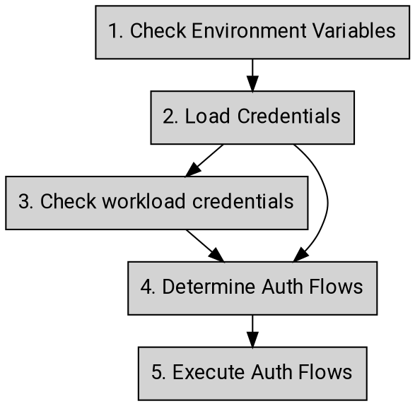

# Application Default Credentials

Google auth libraries use a strategy called _Application Default Credentials
(ADC)_ to detect and select credentials based on environment or context. With
ADC, developers should be able to run the code in different environments and the
supporting systems fetch the appropriate credentials based on each environment
in an effortless manner.

Auth libraries following the standards in these AIPs are known as _"Google
Unified Auth Clients"_, or _GUAC_ for short. The resulting libraries are
colloquially called _GUACs_.

**Note:** Because this AIP describes guidance and requirements in a
language-neutral way, it uses generic terminology which may be imprecise or
inappropriate in certain languages or environments.

## Guidance

### Credential Types

This section outlines the supported credential types of the ADC.

- **Gcloud Credential**: A credential provided by the [Gcloud tool][0] that
identifies a human user that needs to authenticate to access Google APIs. The
auth libraries **must** support this credential type.

- **Service Account Key**: A credential that identifies a non-human user that
needs to authenticate to access Google APIs. The auth libraries **must** support
this credential type.

- **OAuth Client ID**: A credential that identifies the client application which
allows human users to sign-in through [3-legged OAuth flow][1], which grants the
permissions to the application to access Google APIs on behalf of the human
user. The auth libraries **may** support this credential type.

- **External Account Credential**: A configuration file identifying
[external non-Google credentials][8] that can be exchanged for Google access
tokens to access Google APIs. The auth libraries **must** support this
credential type.

### Environment Variables

The auth libraries **must** support the following environment variables to allow
developers to provide authentication configuration for their application:

- **GOOGLE_APPLICATION_CREDENTIALS**: The specified value will be used as the
full path for ADC to locate the credentials file. The credentials file
**should** be one of the following types:

  - Gcloud credentials
  - Service account key
  - External account credentials

  The credentials **may** be the OAuth Client ID if it is supported by the
  auth library. Credentials file path specified at the program level (e.g. via
  client options) **must** have priority over the value of this environment
  variable.

- **GOOGLE_API_USE_CLIENT_CERTIFICATE:** The specified value **must** be
either true or false. The client certificate **must** be ignored if this
variable is set to false. The default value is false if the value is unset.

```
GOOGLE_API_USE_CLIENT_CERTIFICATE=[true|false]
```

### Inputs & Outputs

From the input/output perspective, the inputs of _ADC_ **should** be the
credentials as well as the underlying environment such as environment variables
or metadata service that provides these credentials.

For example, the `GOOGLE_APPLICATION_CREDENTIALS` environment variable can provide
the default credential JSON as the input here, or the well-known path that
gCloud uses to store the default user credential JSON. The output is the access
token that application can use to access the Google APIs. This access token
__may__ be a bearer token, a certificate-bound token, or an identity-bound token
depending on the chosen authentication flow.

## Expected Behavior

This section outlines the expected behavior of the ADC. Auth libraries **must**
implement these concepts in order to be considered complete.



1. **Check environment variables**
  1. Check GOOGLE_APPLICATION_CREDENTIALS
      1. If set, go to step (2.2)
      1. If not set, go to step (2)
1. **Load credentials**
  1. Check [gcloud default credentials][5] through its default path
      1. If found go to step (2.2)
      1. Otherwise go to step (3)
  1. Check the provided credential type
    1. If the credential is gcloud credentials, go to step (4)
    1. If the credential is [a service account key][6] JSON, go to step (4)
    1. If the credential is [an external account][8] JSON, go to step (4)
    1. If the credential is unknown type, return an error saying that _[END]_
  1. Credentials not found _[END]_
1. **Check workload credentials (on GCE, GKE, GAE and Serverless)**
  1. If true,
    1. If identity binding is enabled, by meeting the requirements in
       [mTLS Token Binding][9], use the mTLS Token Binding flow to fetch an
       identity-bound access token _[END]_
    1. If there is an issue when obtaining bound access tokens, return an error
       indicating that _[END]_
    1. If identity binding is not enabled, use the [virtual machine flow][3] to
       fetch an auth token associated with the current environment
      1. If target audience is provided by the developer, get an [identity token][7] _[END]_
      1. Otherwise, get an access token _[END]_
  1. If false, go to step (2.3)
1. **Determine auth flows**
  1. If the credential is gcloud credential go to step (5.3)
  1. If target audience or scope is provided by the developer go to step (5.1)
  1. If the credential is an external account go to step (5.4)
  1. Otherwise, go to step (5.2)
1. **Execute auth flows**
  1. Use 2LO flow to exchange for an auth token
    1. If target audience is provided by the developer, get an [identity token][7] _[END]_
    1. Otherwise, get an access token _[END]_
      1. If client certificate is presented, the exchanged token will be a certificate bind token. _[END]_
  1. Use self-signed JWT flow to create an access token locally.
    1. If certificate is presented, embed the certificate into the JWT.
    1. Use the regular [self-signed JWT flow][4] for an access token. _[END]_
  1. Use user identity flow to exchange for an access token. _[END]_
  1. Use [external account][8] flow to exchange for an access token. _[END]_

## Changelog

- **2019-08-13**: Add a link to virtual machine flow (AIP 4115).
- **2019-08-18**: Remove STS support from ADC.
- **2021-01-20**: Add identity token flow (AIP 4116).
- **2021-06-29**: Guidance for GOOGLE_API_KEY temporarily removed until consensus can be established.
- **2021-12-10**: Add external account credentials (AIP 4117).


<!-- prettier-ignore-start -->
[0]: https://cloud.google.com/sdk/gcloud/reference/auth/application-default/login
[1]: https://developers.google.com/identity/protocols/oauth2/native-app
[3]: ./4115
[4]: ./4111
[5]: ./4113
[6]: ./4112
[7]: ./4116
[8]: ./4117
[9]: ./4119
<!-- prettier-ignore-end -->
