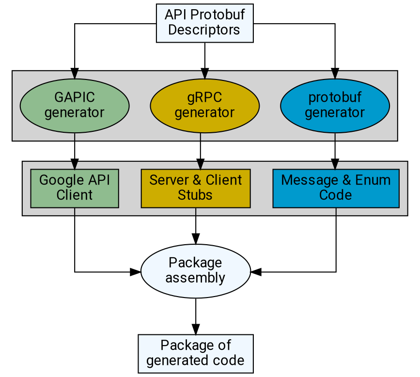

# Client library generators

API guidelines exist in order to promote simple, intuitive, and consistent
APIs. Users familiar with APIs that generally adhere to AIP guidance are able
to take what they learn in prior APIs and apply it to new ones.

Client libraries provide a mechanism for users to get started with APIs more
quickly, by simplifying common concerns (such as auth) and by a language-native
way to call API endpoints and receive language-native responses. However, for
these libraries to provide the most value, they also must be simple, intuitive,
and consistent. Code generators provide a means for producing consistent client
libraries at scale.

Code generators following the standards in these AIPs are known as "generated
API client generators", or _GAPIC generators_ for short. The resulting
libraries are colloquially called _GAPICs_.

**Note:** Because this AIP describes guidance and requirements in a
language-neutral way, it uses generic terminology which may be imprecise or
inappropriate in certain languages or environments (for example, the use of the
term `class` even though languages such as Go do not have classes). This AIP's
particular use of vocabulary is best understood as an explanation of
principles, and precise adherence to exact vocabulary in this AIP is not an
expectation.

## Guidance

The general flow of code generation for client libraries and supporting code in
most supported languages is outlined below.

**Note:** Exceptions to this pattern are typically due to use of a unique stack
e.g. Node.js use of `protobuf.js` and `grpc-node` which don't have code
generation, or Python using a protobuf wrapper in `proto-plus-python`, but the
general GAPIC flow remains the same.

The following sections focus on the "GAPIC generator" in the above diagram.

### Protobuf plugins

The protobuf compiler, `protoc`, supports a [plugin system][0] for code
generation. The plugin system allows plugins to be written _in_ and _for_ any
language.

Code generators **must** be implemented as `protoc` plugins. The following
rules apply to the implementation of a client library generator as a `protoc`
plugin:

- The plugin  **should** be written in the language being targeted for
  generation.
- `protoc` expects plugins to be an executable in `$PATH`, and named
  `protoc-gen-{plugin_name}`, corresponding to the `--{plugin_name}_out` option
  sent to the `protoc` executable. As such:
  - the plugin executable **should** be named `protoc-gen-{lang}_gapic`
  - the plugin option  **should** follow the convention `--{lang}_gapic_out`
- The plugin **must not** leverage `protoc` "insertion points". Despite the
  `protoc` plugin documentation indicating the existence of insertion points,
  their use is unsupported and discouraged by the Protobuf team.

### CLI options

Code generators **should** be able to run without any options or flags if at
all possible, and be able to generate a valid library from only the protos. If
options are required, `protoc` allows them to be passed as
`--{plugin_name}_opt`, and the string provided here becomes set as the
`parameter` string on the `CodeGeneratorRequest`.

**Important:** The `CodeGeneratorRequest.parameter` value is a comma-delimited
string of _all_ associated plugin option values that appear at execution time.
This means that commas cannot be used to delimit list-like plugin option values.

Code generators **must not** rely on environment variables for configuration.

## Expected behavior

This section outlines the expected behavioral attributes of the _output of_ the
client library generator (in other words: the libraries that the generators
write). Client libraries **must** implement these concepts in order to be
considered complete.

### Messages and Enums

Client library generators **should not** generate code for `message` or `enum`
descriptors which are already generated by the Protobuf-provided code
generators.

### Services and methods

Each of the `service` and `rpc` directives in the requested protos **must** be
represented in the client library output, unless the language or transport is
unable to support it.

**Note:** While how to accomplish this may vary from language to language, in
most classical languages it is probably a class for each service, containing
methods for each RPC.

- The classes generated for each `service` directive **must** honor the
  `google.api.default_host` annotation if it is provided, and use that host as
  the default hostname. These classes **should** provide a mechanism for the
  end user to override the hostname.
  - If the `google.api.default_host` annotation is not present on the `service`
    directive, then the generated class **should** require a hostname when it
    is instantiated.
- Additionally, if the classes generated for each service support using OAuth
  and service credentials, they **must** honor the `google.api.oauth_scopes`
  annotation (if it is provided), and use these scopes by default.
- Services that have set the `deprecated` protobuf option to `true` **should** have an
  equivalent deprecation tag generated in the generated class. If applicable, this
  tag may include a comment that specifies when the service will be removed, which
  is typically the next major version update. Similarly, RPCs with this option set
  to `true` **should** have their generated language method(s) marked as deprecated.
- Finally, service classes **must** also accept credentials, which are used
  appropriately when requests are made. (Accepting a custom gRPC channel
  satisfies this requirement.)
- Code generators **must not** generate client _stub_ classes, that would
  normally be generated by gRPC, in addition to client library classes.

### Long-running operations

<!-- TODO(1145): Move to its own client library AIP. -->

An RPC is considered to be a "long-running" RPC if (and only if) the RPC's
return type is [`google.longrunning.Operation`][3]. Any API which has one or
more RPCs returning an `Operation` is expected to implement the `Operations`
service.

Because the `response` and `metadata` fields in [`Operation`][3] are of the
type [`google.protobuf.Any`][4], it is necessary to know what message to use to
deserialize them. This is annotated on the RPC using the
[`google.longrunning.operation_info`][5] annotation.

**Note:** The values in this struct are _strings_, not message objects; the
code generator uses the string to determine the appropriate message to use.
Strings with no period (`.`) character refer to a message in the same proto
package.

Code generators **should** fail with an error if a type is provided in the
[`operation_info`][5] annotation which was not imported, or if no response type
or metadata type is provided. Code generators **should** fail with an error if
_either_ the `response_type` or `metadata_type` keys are omitted.

Client libraries **must** honor the LRO interface; if an RPC has an
[`Operation`][3] as its return type, the generated method **must** intercept it
and return an appropriate idiomatic object for resolving the LRO (such as a
`Future` or `Promise` bound to the underlying [`Operation`][3] object).

### Streaming

Client libraries **must** implement streaming to the extent that their
supporting transports allow. An RPC is considered to be streaming if the
`stream` keyword is present on the argument or response type. This is present
in the [`MethodDescriptorProto`][6] message using the `client_streaming` and
`server_streaming` keys.

<!-- prettier-ignore-start -->
[0]: https://protobuf.dev/reference/other
[1]: https://github.com/google/protobuf/blob/master/src/google/protobuf/compiler/plugin.proto
[2]: https://github.com/google/protobuf/blob/master/src/google/protobuf/descriptor.proto
[3]: https://github.com/googleapis/googleapis/blob/master/google/longrunning/operations.proto#L122
[4]: https://github.com/protocolbuffers/protobuf/blob/master/src/google/protobuf/any.proto
[5]: https://github.com/googleapis/googleapis/blob/master/google/longrunning/operations.proto#L222
[6]: https://github.com/protocolbuffers/protobuf/blob/master/src/google/protobuf/descriptor.proto#L269
<!-- prettier-ignore-end -->

## Changelog

- **2023-06-22**: Added code gen diagram, message/enum guidance, and cleaned up
  plugin & option guidance.