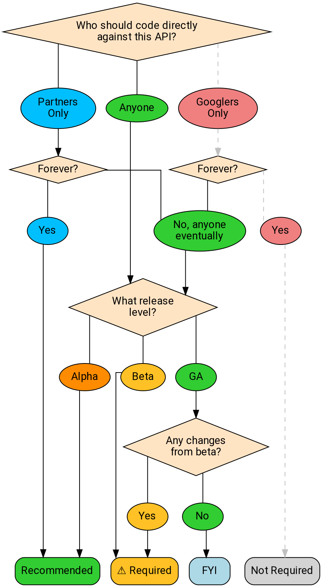

# API Design Review FAQ

API design review exists to ensure a simple, intuitive, and consistent API
experience throughout our API corpus.

## Do I need API design approval?

**TL;DR:** You usually need API design approval if you are launching an API
that users can code against (either now or in the future) at the beta or GA
quality level.

API design review is fundamentally about ensuring we provide a simple and
consistent experience for our users, and therefore is only expected for APIs
that users code directly against.

The following flowchart illustrates whether or not your API needs to go through
the design review process:

### Who should code directly against it?

One of the more complex questions is, "Who should code directly against this
API?" API design review is primarily concerned about the API's audience. This
means we care about who is permitted to write their own HTTP/gRPC calls against
the service, and who is able to see the documentation. (We do _not_ care about
questions such as whether the service is exposed on the public network.)

Design review is expected if the general public is intended to read
documentation and write code that interacts with the service.

The following situations **do not** require design review:

- An API which will only ever be used by Googlers, or internal tools (for
  example, Pantheon).
- An API which will only ever be called by an executable program released by
  Google (even if the API could be reverse-engineered from the executable).
- An API which will only ever be called by a single customer or small set of
  customers under contract, and which will _never_ be made more widely
  available. (Design review is still recommended in this case, but not
  required.)

### Alpha

For alpha, API design review is optional but recommended. It may often make
sense to endeavor to get initial feedback from customers quickly, and launching
an alpha can be a way of gaining data to determine the best answer to some
usability questions; therefore, bypassing review may be expedient. On the other
hand, launching an alpha requires building an implementation which then takes
engineering effort to update if the API design review at the beta stage raises
concerns. Because API design review can precede implementation work, we
recommend a design review for alpha.

## Why is design review important?

**TL;DR:** Product excellence.

Our design review process exists to ensure that the APIs that we present to
customers are **simple**, **intuitive**, and **consistent**. Your reviewer
approaches your API from the standpoint of a naïve user, thinks through the
resources and actions that your API provides, and attempts to make the surface
as accessible and extensible as possible.

Your design reviewer is not only evaluating your API, but also checking to
ensure that your API is consistent with Google's existing corpus of APIs. Many
customers use multiple APIs, and therefore it is important that our conventions
and naming choices line up with customer expectations.

## What should I expect?

### How long does the review process take?

Reviewers make an effort to keep up with their assigned reviews and offer
feedback frequently, so as not to cause unnecessary delay, but it's generally
best to begin the review process early in case there are delays.

The design review process varies based on the size and complexity of the
underlying API surface:

- Incremental changes to existing APIs generally take a few days.
- Small APIs usually take around a week.
- Entirely new APIs with large surfaces tend to take no less than a week. In
  cases with extraordinarily large surfaces (e.g., Cloud AutoML), reviews may
  take a month or more to go through design review.

### How do reviewers approach my API?

API reviewers seek to approach your API the same way that your users will, by
focusing primarily on the API surface and its user-facing documentation. In an
ideal world, your API reviewer will ask the types of design questions that
users will ask (and nudge the API toward raising fewer of those questions in
the first place).

### What is precedent?

In general, we want Google APIs to be as consistent as possible. Once customers
learn their first Google API, it should be easier to learn the second (and then
the third, and so on) because we are using the same patterns consistently.

We refer to **precedent** to mean decisions that have already been made by
previous APIs, which generally should be binding upon newer APIs in similar
situations. The most common example of this is naming: we have a list of
[standard fields][] that dictate how we use common terms like `name`,
`create_time`, and so forth, and which also dictates that we always attach _the
same_ name to the same concept.

Precedent also applies to _patterns_. All APIs should implement pagination the
same way. Ditto for long-running operations, import and export, and so on. Once
a pattern has been established, we seek to implement that pattern the same way
wherever it is germane.

## What should I do?

### ...if I have a launch on a tight deadline?

The best thing that you can do is to engage design review as early as possible.
Additionally, make your reviewers aware of your timeline so that they are
aware, and can endeavor to provide you the best possible service. We _want_ you
to make your deadline if at all possible.

For time-sensitive _alpha_ launches, an API **may** launch without receiving
design review approval. Such launches **must** be limited to a known set of
users. In this case, the reviewers will provide notes for the API team to take
under consideration for subsequent stages.

**Warning:** Launching an API in alpha with an incomplete design review **does
not** enshrine that API's decisions. Design review will be required to promote
the API to beta, and API reviewers will block your beta launch if there are
issues.

For launch stages after alpha, the API design review is mandatory due to its
impact on user experience across the board. Your team's inconsistencies affect
more than just your team.

In some cases, there is a difficult choice to be made between product
excellence and either engineering effort or deadlines. These are difficult
business decisions and we understand that they are sometimes necessary;
however, a director or VP must make an explicit choice to put these other
concerns ahead of product excellence when choosing to bypass design review or
disregard reviewers' feedback.

### ...to make my review go faster?

A few tips:

- Begin API review as early as possible, and follow up frequently.
- Run the [API linter][] beforehand. (If you are disabling the linter at any
  point, explain why. Reviewers often find that the linter is disabled because
  it did its job.)
- Ensure that every message, RPC, and field is _usefully_ commented. Comments
  should be in valid American English and say something meaningful.
- If your API reviewer asks you to explain something, add the explanation _in
  the proto comments_, rather than the code review conversation. This will very
  often save you a round trip.

### ...if one of my API reviewers is unresponsive?

Reach out to the reviewer on Chat. If that fails, reach out to the other
reviewer, who will coordinate accordingly. If that fails also, escalate
according to [AIP-1][].

### ...if I have a design question?

The first places to look at the [API style guide][], the [AIP index][], and
other public APIs within Google. Other public APIs are particularly valuable;
it is common that someone has encountered a situation that is germane to your
question.

### ...if I have a question not covered there?

Reach out to api-design@google.com with your question.

This generally works best when you are seeking guidance on a specific question
related to API design, and when you clearly explain your use case and provide
examples.

**Note:** The membership of this list comprises almost exclusively volunteers,
who spend the majority of their time doing something else. We do our best to be
responsive, but please be patient with us.

### ...if a question is complex and languishing in a CL?

While the code review interface is the best way to resolve questions when
practical, sometimes there are issues that are sufficiently complicated that
working them out in the code review tool is not feasible. In this situation,
reach out to your reviewers and ask to schedule a meeting. In general, most
issues can be discussed in 30 minutes.

When this happens, make sure that someone documents what is discussed in the
CL, so that the history is preserved.

### ...if my API needs to violate a standard?

Clearly document (using an internal comment in the proto) that you are
violating an API design guideline and your rationale for doing so. This comment
**must** be prefixed with `aip.dev/not-precedent`.

In general, your rationale for the design guideline violation **should** be in
accordance with one of the enumerated reasons listed in [AIP-200][]. If it is
not, work together with your API reviewer to determine the right thing to do.

### ...if a reviewer is bringing up a previously-settled issue?

If you have a different reviewer from your API's previous stages, this might
happen. In general, the best approach is simply to reference the code review
where the issue was decided. Reviewers want to avoid causing you churn, and
therefore usually give deference to previous reviews. This is usually
sufficient to resolve the question promptly.

Occasionally, the reviewer may believe that the previous reviewer made a
significant mistake, and that correcting it is important. In this case, you and
your reviewer should work together to determine the best course of action.

### ...if the team and the reviewers strongly disagree?

Escalate according to [AIP-1][].

## Does my PA or team have any particular guidelines?

The Cloud PA has specific guidelines to ensure additional uniformity across
Cloud, and Cloud APIs have their own reviewer pool. Other teams may adopt
similar (but not necessarily identical) rules and systems. Some teams that
produce multiple APIs (for example, machine learning) may also have guidelines
that apply to that group of APIs.

In all cases, we endeavor to make these guidelines available as AIPs; the
higher AIP numbers are reserved for specific PA and team use (see [AIP-2][]),
and these AIPs are listed in the [AIP index][].

[aip-1]: ./0001.md
[aip-2]: ./0002.md
[aip-200]: ./0200.md
[aip index]: /
[api linter]: https://github.com/googleapis/api-linter
[api style guide]: https://cloud.google.com/apis/design/
[standard fields]: https://cloud.google.com/apis/design/standard_fields
